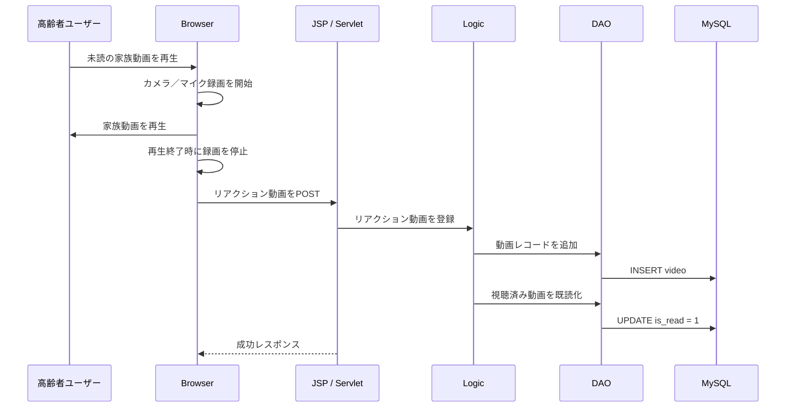

# つながるーむ（Connect Room）

[English](README.md) | **日本語**

高齢者と家族の非同期ビデオコミュニケーションを、より使いやすくするために設計したJava／JSP Webアプリケーションです。

> **プロジェクト背景：** チーム研修プロジェクトとして開発しました。本リポジトリは、実装および設計業務をポートフォリオとして説明することを目的としています。個人の担当範囲は下記に明記しており、チーム・研修由来の成果物は再配布が許可される範囲でのみ公開します。

## 主な機能

- 高齢者用と家族用に分かれた画面・利用フロー
- 家族によるビデオ撮影・アップロード
- 高齢者側で未読ビデオを再生
- 再生中の高齢者のリアクションを自動録画
- リアクション動画の保存と既読状態の更新
- 過去に撮影した動画の閲覧
- 位置履歴の保存と地図表示
- シンプルなアプリ内通知

## コアフロー



## アーキテクチャ

```text
Browser（JSP / JavaScript）
        |
        v
Controller（Servlet）
        |
        v
Logic層
        |
        v
DAO / DTO
        |
        v
MySQL
```

## 技術スタック

- Java 21
- Jakarta Servlet／JSP
- JavaScript
- HTML／CSS
- MySQL 8
- Apache Tomcat 10
- Eclipse Dynamic Web Project
- Google Maps JavaScript API（位置情報画面は任意）

## プロジェクト構成

```text
src/main/java/
├── controller/   # HTTPリクエスト処理
├── logic/        # アプリケーションロジック
├── dao/          # データベースアクセス
└── dto/          # データ転送オブジェクト

src/main/webapp/
├── assets/js/    # ブラウザ側の処理
├── css/          # 画面スタイル
├── img/          # UIアセット
├── video/        # 実行時生成動画（Git対象外）
└── WEB-INF/
    ├── DB/       # DB初期化スクリプト
    └── lib/      # プロジェクトライブラリ
```

## 担当範囲

主にシステム設計と動画インタラクションフローを担当しました。

- 動画再生とリアクション自動録画の連携設計
- Servlet → Logic → DAO処理フローの構造化
- 未読／既読など動画状態管理の設計
- 録画・アップロード処理の一部実装とレビュー
- 画面／サーバー処理設計およびチーム実装レビューへの参加

チームプロジェクトのため、本リポジトリ内のすべてのファイルを私一人が作成したものとはしていません。

## ローカルセットアップ

### 1. 必要環境

- JDK 21
- Apache Tomcat 10
- MySQL 8
- Web Tools Platformを含むEclipse IDE、または同等のJakarta Servlet実行環境

### 2. データベース初期化

次のSQLを実行します。

```text
src/main/webapp/WEB-INF/DB/connect_room.sql
```

このスクリプトは`connect_room`データベースを再作成します。保持すべきデータがあるDBでは実行しないでください。

### 3. DB環境変数

パスワードはソース管理に保存しません。

```bash
CONNECT_ROOM_DB_URL=jdbc:mysql://localhost:3306/connect_room?characterEncoding=UTF-8&serverTimeZone=JST
CONNECT_ROOM_DB_USER=your-db-user
CONNECT_ROOM_DB_PASSWORD=your-local-password
```

3変数すべてが必須です。`.env.example`を参考にしつつ、OSまたはサーバーの環境変数として設定してください。アプリケーション自体は`.env`ファイルを読み込みません。

### 4. Google Maps（任意）

位置情報画面を使用する場合：

```bash
GOOGLE_MAPS_API_KEY=your-key
```

公開環境ではGoogle Cloud上でAPI制限とHTTP Referrer制限を設定してください。

### 5. Tomcatで起動

既存Eclipseプロジェクトとしてインポートし、`Tomcat10 (Java21)`ランタイムを設定してデプロイします。

```text
/connect-room/seniorTitle.jsp
/connect-room/familyTitle.jsp
```

## セキュリティ／リポジトリ管理

- 実行時に生成される`.webm`録画ファイルはGit対象外です。
- DB接続情報とパスワードは環境変数から読み込みます。
- 公開準備版のDB接続ヘルパーは、研修提供ファイルではなく独自に作成したJDBC実装です。
- Google Maps API Keyは環境変数から読み込みます。
- ビルド成果物はGit対象外です。
- デモSQLには実際の録画動画や位置履歴を含めていません。

## 今後の改善

- リポジトリ内JAR管理からMaven／Gradleへ移行
- 平文パスワードをハッシュ化
- 高齢者／家族ロール間の認証・認可境界を追加
- DAO・ビジネスロジックの自動テスト追加
- コンパイルとテストのCI追加
- 動画保存先をWebアプリケーションディレクトリからオブジェクトストレージへ移行
