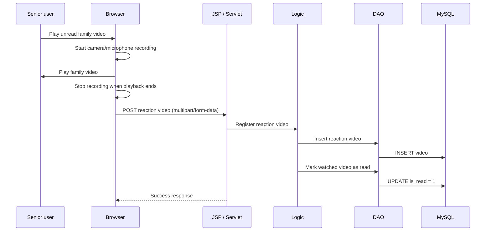

# つながるーむ (Connect Room)

A Java/JSP web application designed to make asynchronous video communication easier between seniors and their families.

> **Project context:** This was developed as a team training project. This repository is intended to document the implementation and design work for portfolio purposes. Individual contributions are identified below; publication of team/course assets should only be done when redistribution is permitted.

## What it does

- Separate senior and family experiences
- Record and upload family videos
- Play unread videos for the senior user
- Automatically record a reaction video while the senior watches a video
- Store reaction videos and update watched/read state
- Browse previously recorded videos
- Store and display location history on a map
- Display simple in-app notifications

## Core flow



## Architecture

```text
Browser (JSP / JavaScript)
        |
        v
Controller (Servlet)
        |
        v
Logic layer
        |
        v
DAO / DTO
        |
        v
MySQL
```

## Tech stack

- Java 21
- Jakarta Servlet / JSP
- JavaScript
- HTML / CSS
- MySQL 8
- Apache Tomcat 10
- Eclipse Dynamic Web Project
- Google Maps JavaScript API (optional location screen)

## Project structure

```text
src/main/java/
├── controller/   # HTTP request handling
├── logic/        # application logic
├── dao/          # database access
└── dto/          # data transfer objects

src/main/webapp/
├── assets/js/    # browser-side behavior
├── css/          # screen styles
├── img/          # UI assets
├── video/        # runtime-generated videos (ignored by Git)
└── WEB-INF/
    ├── DB/       # database initialization script
    └── lib/      # project libraries
```

## My contributions

My work focused mainly on system/design responsibilities and the video interaction flow, including:

- Designing the interaction between video playback and automatic reaction recording
- Structuring the Servlet → Logic → DAO flow
- Integrating video state management such as unread/read status
- Implementing and reviewing parts of the recording/upload behavior
- Participating in screen/server processing design and team implementation reviews

Because this was a team project, this repository does **not** claim that every file was authored solely by me.

## Local setup

### 1. Requirements

Install:

- JDK 21
- Apache Tomcat 10
- MySQL 8
- Eclipse IDE with Web Tools Platform (or an equivalent Jakarta Servlet environment)

### 2. Initialize the database

Run:

```text
src/main/webapp/WEB-INF/DB/connect_room.sql
```

The script recreates the `connect_room` database, so do not run it against a database containing data you need.

### 3. Set database environment variables

The application intentionally does not store a database password in source control.

```bash
CONNECT_ROOM_DB_URL=jdbc:mysql://localhost:3306/connect_room?characterEncoding=UTF-8&serverTimeZone=JST
CONNECT_ROOM_DB_USER=your-db-user
CONNECT_ROOM_DB_PASSWORD=your-local-password
```

All three database variables are required. Copy `.env.example` as a reference, but configure the values as operating-system/server environment variables; the application does not load `.env` files by itself.

### 4. Optional: Google Maps

For the location map screen, set:

```bash
GOOGLE_MAPS_API_KEY=your-key
```

Use API restrictions and HTTP referrer restrictions in Google Cloud when deploying publicly.

### 5. Run on Tomcat

Import this directory as an existing Eclipse project, configure the `Tomcat10 (Java21)` runtime, deploy the project, and open one of the title pages, for example:

```text
/connect-room/seniorTitle.jsp
/connect-room/familyTitle.jsp
```

## Security / repository hygiene

- Runtime `.webm` recordings are excluded from Git.
- Database connection settings and passwords are read from environment variables.
- The database connection helper in this public-preparation copy is an independently written JDBC implementation rather than the training-provided attributed file.
- The Google Maps API key is read from an environment variable.
- Build output is excluded from Git.
- Demo SQL intentionally contains no real video recordings or location history.

## Future improvements

- Migrate dependency management to Maven or Gradle instead of checked-in JAR files
- Hash user passwords instead of storing plain text values
- Add authentication and authorization boundaries between senior/family roles
- Add automated tests for DAO and business logic
- Add CI for compilation and tests
- Move runtime video storage to object storage instead of the web application directory
